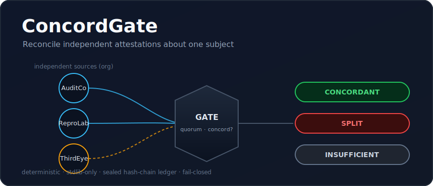

<p align="center">
  
</p>

# ConcordGate

**Reconcile independent attestations about one subject — do they concord, or does the evidence split?**

Many tools verify a single action, handback, or settlement. ConcordGate answers a
different question. Given N independent, sealed attestations about **one** subject
(a release, an artifact, a decision), it decides whether they **agree** — and if
they don't, it names the exact contradiction.

The independence unit is the attester **organization**: ten attestations from one
org still count as one source, so self-testimony can never inflate agreement.

## Verdict (3-way, fail-closed)

| verdict | meaning | exit |
|---|---|---:|
| `CONCORDANT` | a quorum of independent orgs agree on every shared claim | 0 |
| `SPLIT` | independent orgs (or one org with itself) contradict on a field — every conflict is named | 3 |
| `INSUFFICIENT` | fewer than `quorum` independent orgs; concordance is unproven | 2 |

Uncertainty fails closed: missing quorum yields `INSUFFICIENT`, never `CONCORDANT`.

## Install

Pure Python standard library, no dependencies. Python 3.8+.

```bash
git clone <this repo> && cd ConcordGate
```

## Use (sample / run / report)

```bash
# 1. emit a runnable example attestation set
python concordgate.py sample > atts.json

# 2. reconcile a set -> sealed verdict (optionally append to a hash-chain ledger)
python concordgate.py run --attestations atts.json --ledger .cg/ledger.jsonl

# 3. recompute verdicts from the ledger and re-verify the chain
python concordgate.py report --ledger .cg/ledger.jsonl
```

Try the bundled examples:

```bash
python concordgate.py run --attestations examples/concordant.json    # -> CONCORDANT (exit 0)
python concordgate.py run --attestations examples/split.json         # -> SPLIT (exit 3)
python concordgate.py run --attestations examples/insufficient.json  # -> INSUFFICIENT (exit 2)
```

## Attestation format

```json
{
  "subject_id": "release-2026.4.0",
  "attestations": [
    {
      "attester": {"id": "alice", "org": "AuditCo"},
      "subject_id": "release-2026.4.0",
      "claims": {"sha256": "abc123", "signed": true, "sbom": "present"},
      "attestation_sha256": "<sealed by seal_attestation>"
    }
  ]
}
```

Seal an attestation programmatically:

```python
import concordgate as cg
att = cg.seal_attestation({
    "attester": {"id": "alice", "org": "AuditCo"},
    "subject_id": "release-2026.4.0",
    "claims": {"sha256": "abc123", "signed": True},
})
rec = cg.reconcile([att, ...], subject_id="release-2026.4.0", quorum=2)
print(rec["verdict"], rec["conflicts"])
```

## How reconciliation works

- Each attestation is validated and sealed (canonical-JSON SHA-256).
- Attestations with a broken seal, or about a different subject, are excluded and
  reported — never silently dropped.
- The independence unit is `attester.org`. Independent sources = distinct orgs.
- For every shared claim field:
  - **same-source** conflict — one org holding two different values;
  - **cross-source** conflict — two orgs holding different values.
- Verdict: `INSUFFICIENT` if distinct orgs `< quorum`; else `SPLIT` if any
  conflict; else `CONCORDANT`.
- Each reconciliation can be appended to an append-only, parent-chained,
  sealed ledger; `report` re-verifies the whole chain.

## Honesty & security boundary

Seals are **unkeyed SHA-256** over canonical JSON: this is **integrity**
(tamper-evident against accidental edits and honest mistakes), **not
authenticity** against a key-holding adversary who rebuilds the ledger. Verdicts
are deterministic: the same attestations always produce the same sealed verdict.

Deterministic and standard-library only — no clock, network, subprocess,
randomness, or AI in the decision path.

## Tests

```bash
python -m pytest tests/ -q
```

## License

MIT — see [LICENSE](LICENSE).
