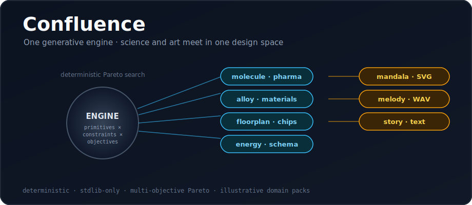

<p align="center">
  
</p>

# Confluence

**One generative engine. Drug motifs, alloys, chip floorplans, energy mixes, data schemas — and mandalas, melodies, and stories — all come out of the same deterministic search.**

Drug design, materials, semiconductor floorplanning, energy planning, data
modeling, and the arts look unrelated. They share one abstraction:

> **compose primitives, under constraints, toward multiple objectives.**

Confluence is one engine over that abstraction. Define a domain as four functions
— `positions` (choices per locus), `constraints`, `objectives` (all maximized),
`render` — and the engine generates candidate designs, keeps the **Pareto-optimal
(non-dominated) set**, and **evolves** it over generations. Deterministically.

## The eight domains

| domain | field | a candidate is… | renders |
|---|---|---|---|
| `molecule` | pharma | a fragment sequence | text |
| `alloy` | materials | an element composition | text |
| `floorplan` | semiconductor | a block placement | text |
| `energy` | energy | a generation mix | text |
| `schema` | data | a set of fields | text |
| `mandala` | art | symmetry / palette / shape | **SVG** |
| `melody` | music | a note sequence | **WAV** |
| `story` | narrative | a beat sequence | text |

Every objective is **maximized**; "low_cost" etc. are already framed so higher is
better. The Pareto front is the set of designs where you can't improve one
objective without sacrificing another — the honest answer when goals conflict.

## Use (domains / run / report)

```bash
# list domains and their objectives
python confluence.py domains

# evolve a Pareto set for one domain, render the best artifact
python confluence.py run --domain mandala --seed spring --render out.svg
python confluence.py run --domain melody  --seed spring --render out.wav
python confluence.py run --domain molecule --seed lead-42 --objective potency

# log runs and summarize
python confluence.py run --domain energy --seed grid --ledger runs.jsonl
python confluence.py report --ledger runs.jsonl
```

`--objective X` renders the candidate that is best on objective `X` (otherwise the
first front member). `--seed` makes every run reproducible; the same seed always
produces the same sealed result.

The [`examples/`](examples/) artifacts — `mandala.svg`, `melody.wav`,
`story.txt` — were produced by the engine itself.

## Add a domain in ~20 lines

```python
DOMAINS["gizmo"] = {
    "name": "gizmo",
    "positions": [PARTS] * 5,                 # choices per locus
    "constraints": lambda g: [...],           # list of violations (empty = valid)
    "objectives": lambda g: {"a": ..., "b": ...},  # floats, all maximized
    "summary": lambda g: "...",               # short text
    "render": lambda g: {"format": "text", "content": "..."},
}
```

The engine — generation, Pareto selection, evolution, sealing — is reused
unchanged. Science pack or art pack, it is the same 4-function contract.

## Honest boundary

The domain packs are **illustrative models, not production R&D tools.** Confluence
does not discover real drugs, design manufacturable chips, or plan a real grid —
the scoring functions are deliberately simple. Its point is the **unifying
abstraction** and the demonstration that **one generative engine crosses science
and art.** Treat the outputs as a design-search sandbox, not engineering advice.

Deterministic and standard-library only: candidate generation and variation come
from SHA-256 of a seed — no `random`, no clock. Runs are sealed (canonical-JSON
SHA-256); the same inputs always reproduce the same result.

## Tests

```bash
python -m pytest tests/ -q
```

## License

MIT — see [LICENSE](LICENSE).
