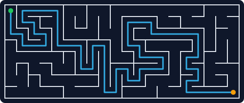

<p align="center">
  
</p>

# Meander

**A deterministic maze generator and solver. Same seed, same maze — every time.**

Give Meander a width, a height, and a seed. It carves a **perfect maze** — a
spanning tree over the grid, so there is exactly one path between any two cells
and the maze is *always* solvable. It finds the shortest solution, scores the
maze's playability, and renders it as ASCII or SVG.

No randomness, no clock: the maze is a pure function of `(width, height, seed)`,
so a seed is a shareable, reproducible maze.

## Use (sample / generate / solve)

```bash
# a small solved example
python meander.py sample

# carve a maze (optionally overlay the solution, optionally write an SVG)
python meander.py generate --width 24 --height 14 --seed spring
python meander.py generate --width 24 --height 14 --seed spring --solution --svg maze.svg

# carve the same maze and print the shortest path + metrics
python meander.py solve --width 24 --height 14 --seed spring --svg solved.svg
```

The [`examples/`](examples/) files — `maze.svg`, `solved.svg`, `maze.txt` — were
produced by Meander itself.

## Output

ASCII (with the solution as `.`):

```
+---+---+---+---+
| .   . |       |
+---+   +   +---+
|     . |   .   |
+   +---+---+   +
|         | .   |
+---+---+---+---+
```

Plus metrics:

```json
{"cells": 336, "solution_length": 71, "dead_ends": 96, "junctions": 40, "difficulty": 0.3304}
```

`difficulty` is a normalized blend of solution length and junction density — a
rough "how twisty is it" score, not a claim about human solving time.

## Library

```python
import meander as mz
maze = mz.generate(20, 12, seed="lantern")
path = mz.solve(maze)                 # shortest path, always exists
print(mz.render_ascii(maze, path))
open("m.svg", "w").write(mz.render_svg(maze, path))
print(mz.metrics(maze, path))
```

## Guarantees

- **Deterministic** — `(w, h, seed)` fully determines the maze (SHA-256 of the
  seed drives the carve; no `random`, no clock).
- **Always solvable** — a perfect maze is a spanning tree: `cells - 1` passages,
  a unique path between any two cells.
- Standard library only. No dependencies.

## Honest note

Meander is a recreational tool — a clean, reproducible generator+solver — not a
research artifact. It is the third distinct-character project produced by the
HELIX generative loop (verify → design → **play**).

## Tests

```bash
python -m pytest tests/ -q
```

## License

MIT — see [LICENSE](LICENSE).
