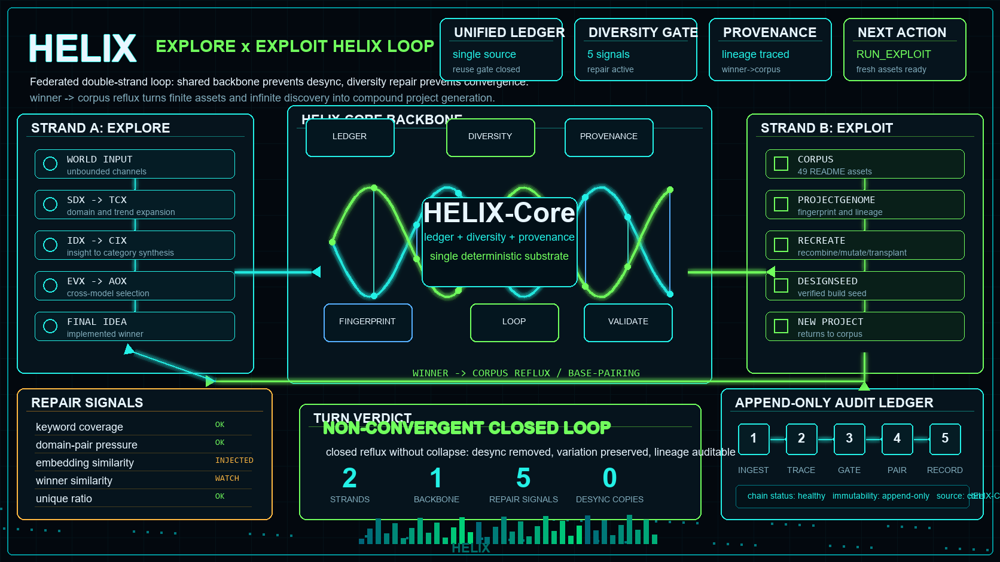
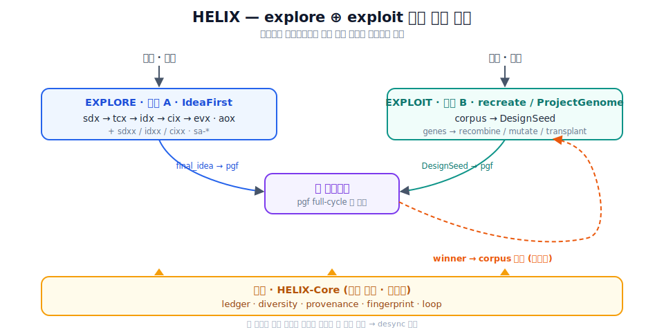

[](https://github.com/sadpig70/HELIX/actions/workflows/ci.yml)

# HELIX

> **두 상보 가닥을 공유 백본이 묶어, 환류하는 폐루프인데도 매 회전 동질화를 차단해
> 수렴 없이 복리로 성장하는 자율 창조 시스템.**

HELIX는 두 시스템을 **하나의 자기완결 repo로 통합**한다 — 모든 스킬을 `skills/`에 vendor하되,
내부 로직은 공유 백본(HELIX-Core)을 **단일 출처**로 두어 desync를 막는다.

<p align="center">
  
</p>

<details><summary>같은 그림 (텍스트)</summary>

```
   세계(무한)                                   자산(유한)
      │ EXPLORE (가닥 A)                          │ EXPLOIT (가닥 B)
   IdeaFirst (sdx→tcx→idx→cix→evx, aox)        recreate / ProjectGenome (corpus→seed)
      │ final_idea ── pgf로 구현 ──► 새 프로젝트 ──┐
      └──────────── winner→corpus 환류(염기쌍) ◄──┘
              ▲ 백본(HELIX-Core): ledger · diversity · provenance · fingerprint · loop
```

</details>

원이 아니라 **나선**인 이유가 곧 가치다: 백본이 두 가닥의 desync를 없애고(단일 출처),
다양성 게이트가 회전마다 폭을 유지해(복구효소), 폐루프인데도 출력이 수렴하지 않는다.

## 왜 합쳤나 (한 줄)

두 엔진은 **explore↔exploit 상보쌍**이고, 각자 *동질화 차단·소모 ledger·cross-model 합의*라는
같은 기계를 **중복 구축**해 두었다. HELIX는 그 중복을 백본에 한 번만 정의해 desync를 제거하고,
`winner→corpus` 환류로 두 엔진을 하나의 상승 나선으로 잇는다.

## 제3 가닥: Condense — project generator → platform generator (v0.5)

explore⊕exploit는 *개별 프로젝트*를 발산 생성한다. 그러나 corpus는 같은 **machine**(hash-chain
ledger·verdict severity·predicate gate·clearing·routing…)을 공유하는 클러스터로 스스로 조직화한다.
**Condense** 가닥은 그 클러스터를 **kernel+plugin 플랫폼으로 수렴**시킨다 — 다양성 게이트가 생성
발산을 지키는 것과 대칭으로, **플랫폼 층의 의도적 수렴**. HELIX가 프로젝트 → **플랫폼** → 생태계로
층이 쌓이는 나선이 된다.

- **실증된 5개 플랫폼** (각 corpus 클러스터를 원본 실코드 parity로 승격, 전부 독립 저장소·public·CI green):
  [Attestra](https://github.com/sadpig70/Attestra)(attest) ·
  [Clearstra](https://github.com/sadpig70/Clearstra)(clear) ·
  [Routestra](https://github.com/sadpig70/Routestra)(route) ·
  [Certstra](https://github.com/sadpig70/Certstra)(certify — **Condense emit**) ·
  [Scorestra](https://github.com/sadpig70/Scorestra)(score — **Condense emit**).
  앞 넷을 한 결정으로 잇는 [stra-demo](https://github.com/sadpig70/stra-demo)(route→clear→certify→attest).
- **machine-aware 라우팅**: 클러스터의 machine이 기존 플랫폼에 이미 있으면 새 플랫폼(CONDENSE)이 아니라
  기존 플랫폼에 팩 추가(BUILD_ON_PLATFORM) — 커널 중복 방지. **실증**: 이름이 같던 "Compatibility Mesh"
  5형제(SovMesh·PqcMesh·SignalMesh·FlowMesh·AgentMesh)를 실코드 machine으로 판정해 **3개 플랫폼에 분산**
  흡수했다 — 새 커널 0개: Attestra 게이트(`sov-mesh`·`pqc-mesh`·`signal-mesh`) · Routestra bound(`flow-mesh`)
  · Clearstra price(`agent-ops`). 각 팩은 원본과 parity 테스트 동봉.
- **루프 편입**: `core/helix_loop.py` `next_action`이 `CONDENSE`/`BUILD_ON_PLATFORM`을 1급 액션으로 제안
  (`helix.py status --layered-corpus seed/condense/layered-corpus.json`). 레시피는 `skills/condense` 스킬.
- **완주한 라우팅 sweep**: corpus 후보 풀 전체를 machine으로 판정해 **3분류로 완전 배정** —
  **흡수 20**(clean gate/primitive → 팩 + 원본 parity 테스트) · **defer 2**(RouteSentinel·EndowFront) ·
  **design-only 8**(코드 없음). **5개 플랫폼**이 corpus에서 성장:
  **Attestra 23 · Clearstra 12 · Routestra 11 · Certstra 5 · Scorestra 5 (총 56팩)**. 라우팅은 **이름이 아니라
  machine**으로 판정하며 양방향 교정한다(AgentMesh: Attestra→Clearstra, SettleMesh: Clearstra→Attestra).
  "Bio drift(M11)" CONDENSE 가설은 실코드로 **반증**했으나, defer됐던 스코어링 클러스터의 **novel M15
  machine**(가중 score→등급 tier→집계)을 확정 → HELIX가 스스로 **CONDENSE를 제안·실행해 5번째 플랫폼
  Scorestra를 emit**했다(Certstra에 이은 2번째 CONDENSE, 2-D rule-ladder 커널로 클러스터 5/5 흡수). 결과:
  `build_on_platform_candidate()`·`condense_candidate()` 모두 `None` — corpus 완전 라우팅.
- 상세: [`docs/CONDENSE.md`](docs/CONDENSE.md).

## 구조

```
HELIX/
├── README.md
├── .pgf/                     # PGF 설계·계획·상태 (이 프로젝트는 pgf full-cycle로 지어졌다)
│   ├── DESIGN-HELIX.md
│   ├── WORKPLAN-HELIX.md
│   └── status-HELIX.json
├── core/                     # ★ HELIX-Core 백본 — 단일 출처 결정론 substrate (stdlib only)
│   ├── helix_fingerprint.py  #   정체성 primitive (ProjectGenome에서 승격)
│   ├── helix_ledger.py       #   통합 소모/등록 ledger — 재사용 차단 게이트
│   ├── helix_diversity.py    #   통합 동질화/다양성 측정 (복구효소)
│   ├── helix_provenance.py   #   계보 + winner→corpus 환류 (염기쌍)
│   ├── helix_loop.py         #   explore↔exploit 루프 드라이버 (나선 회전)
│   └── helix_validate.py     #   구조·계약 검증기
├── skills/                   # ★ ALL 스킬 (자기완결) — IdeaFirst 14 + recreate 2 + 공유 pg/pgf/pgxf
│   ├── pg/ pgf/ pgxf/        #   공유 표기 (1벌, dedup) — pgf/discovery/personas.json 포함
│   ├── sdx/ sdxx/ sdx_ci/ tcx/ idx/ idxx/ cix/ cixx/ evx/ aox/   # explore
│   │   sa-aox/ sa-evx/ sa-icx/ collect_git_trand/
│   └── recreate/ pgfr-combo/                                     # exploit
├── scripts/                  # 결정론 runner (explore/ 12+ · exploit/ 4)
├── seed/                     # durable 입력/상태 (sdx-catalog · idea-ledger · corpus)
├── RUNBOOK.md                # ★ 두 시스템 전 기능 호출법
├── MIGRATION.md              # vendoring 출처·결정 기록
├── helix.py                  # ★ 드라이버 — 두 엔진 상태→통합 ledger→diversity→next_action
├── engines/                  # 가닥 어댑터 — vendored 스킬 ↔ core 배선. 실코드 구현됨.
│   ├── explore/adapter.py    #   가닥 A — IdeaFirst(.evx/.cix/.idea-ledger) → 백본
│   ├── exploit/adapter.py    #   가닥 B — recreate(.recreate/registry.json) → 백본 + handback 게이트
│   ├── unify.py              #   두 엔진 ledger 병합 (단일 출처 join)
│   └── loaders.py            #   I/O glue (JSON; YAML은 PyYAML 있을 때만)
├── ActionHandbackVerifier/   # ★ exploit 산출물 — handback 검증 CLI + 백본 게이트 (stdlib only)
│   ├── verifier.py           #   5-predicate 검사 (authority·custody·route·rollback·trace)
│   ├── ledger.py             #   append-only hash-chain audit ledger
│   └── cli.py                #   sample / run / report / verify
├── schemas/                  # 백본 데이터 계약 (JSON Schema 4종)
├── docs/
│   ├── ARCHITECTURE.md       # 이중나선 → 시스템 매핑 (정정판, §7 핸드백 게이트)
│   └── SUBSTRATE-CONTRACT.md # HELIX-Core 단일 출처 계약 (§8 handback 게이트 포함)
├── examples/                 # 샘플 ledger + 1라운드 루프
└── tests/                    # 결정론 helper unittest (stdlib only)
```

## 결정론 경계

- **HELIX-Core = 순수 결정론**: stdlib only, 시계/네트워크/AI 없음. 시간은 주입(`now`),
  의미 유사도는 주입(`sim`). 임베딩·LLM은 엔진 책임.
- **exploit 생성물 verdict 경로 = 결정론 불변** (ProjectGenome 규율 계승).
- **엔진 내부 LLM 단계 = 메타층** — HELIX 경계 밖.

## 빠른 시작

```bash
# 한 회전 읽기 (픽스처 위에서 — 두 엔진 상태 → 다음 액션). read-only.
python helix.py status

# 실제 엔진 위에서 (IdeaFirst .evx*.yaml 은 PyYAML 필요)
python helix.py status --explore-root D:/IdeaFirst --exploit-root D:/recreate_prj/ProjectGenome

# ★ 루프 폐쇄 (write, actuator): 구현된 winner를 ledger에 기록 + 코퍼스로 환류(염기쌍). idempotent.
python helix.py close-loop --winner winner.json --ledger .helix/ledger.json --corpus .helix/corpus.json

# 자율 루프의 결정론 제어 상태 (정지여부 + coverage). read-only.
python helix.py loop-status --loop-state .helix/loop/loop-state.json --ledger .helix/ledger.json

# 백본 검증 (구조 + 계약 스키마 강제 + 예제 일관성) / 테스트 / fingerprint CLI
python core/helix_validate.py .
python -m unittest discover -s tests -q
python core/helix_fingerprint.py source ADPR ReleaseMesh PnR
```

`helix.py status` 출력 예 (픽스처):

```text
=== HELIX turn ===
  unified ledger: 2 entries (explore=1, exploit=1)
  diversity pool: 7 items | triggered=False (sim=lexical, breaches=1)
  latest explore winner: IDEA-018 "Time-Box Automation Enforcer" -> already_consumed=False
      lineage: IDEA-018 -> INS-L10-007 -> EVX-... -> CIX-... -> IDX-... -> TCX-... -> v2
  base-pairing (explore->corpus): AgentPACT
  NEXT ACTION: RUN_EXPLOIT  (fresh assets accumulated -> recombine (compound))
```

## 하위 네이밍

- **HELIX-A / HELIX-B** — 두 엔진 가닥 (explore / exploit)
- **HELIX-Core (Backbone)** — 공유 substrate
- **HELIX-Gate** — 5점 다양성/복구 게이트 (sdxx→idxx→cixx→avoidance→cross-model)
- **HELIX-Loop** — explore↔exploit 폐루프

## 설계 불변식 & 확장점

전부 *동작하는 사실*이다 — 보류된 caveat이 아니다.

- **자기완결 모노레포 · 단일 출처 백본.** 모든 스킬을 `skills/`에 vendor하되 ledger/diversity/
  provenance/fingerprint/loop는 `core/`에 한 번만 정의해 두 엔진이 공유 → desync 불가 (`MIGRATION.md`).
- **pgf 의존성 폐쇄 검증됨.** vendored 스킬의 pgf 기계 의존성은 `pgf/discovery/personas.json` 하나뿐이며
  두 트리 동일. 나머지 pgf 차이는 prose-only로 실행 영향 0 (재현 명령 `MIGRATION.md §1`).
- **다양성 신호는 항상 완전 · 의미유사도는 플러그인.** `core/helix_diversity`는 결정론 `lexical_sim`
  기본을 탑재해 외부 의존 없이 완전한 report를 낸다(`sim_kind="lexical"`). 임베딩 `sim`을 주입하면
  semantic 등급으로 격상(`sim_kind="semantic"`) — 임베딩은 엔진 책임이라는 결정론 경계의 깔끔한 확장점.
- **임계값은 출처·보정 절차 명시 + override API.** 각 기본값의 provenance와 코퍼스/sim별 재보정 절차는
  `docs/CALIBRATION.md`; `measure_diversity(..., thresholds={...})`로 즉시 덮어쓴다.
- **백본 중심 = N가닥 확장 가능.** 불변항은 가닥 수가 아니라 백본. explore 소스가 3+로 늘어도
  드라이버는 가닥 목록을 받아 라운드를 배분할 뿐(가닥 추가 = 어댑터 추가, `docs/ARCHITECTURE.md §6`).
- **결정론 경계.** `core/`+어댑터는 순수 stdlib(시계·네트워크·AI 없음, `now`/`sim` 주입); 엔진 LLM
  단계는 메타층; exploit 생성물 verdict 경로는 결정론 불변.
- **exploit 구현물 handback 검증 = 결정론 게이트.** `ActionHandbackVerifier`(stdlib)가 exploit
  생성물의 handback boundary(권한·인계·경로·롤백·추적)를 검증하며, `breach` 판정은 통합 ledger
  `consumed`에서 제외된다. `verify-handback` actuator가 verdict를 registry에 영속화하고
  `registry_to_ledger` read가 persisted verdict를 신뢰하여 읽기/쓰기 루프를 폐쇄한다
  (`RUNBOOK §핸드백 게이트`).

### 범위 밖 (non-goals, 결함 아님)
- 임베딩 모델 자체는 미동봉(주입 인터페이스 제공). 시장 수요·상업성 판단은 범위 밖(엔진의 평가층 소관).

## 라이선스

[MIT License](LICENSE) © 2025–2026 sadpig70 (Jung Wook Yang)
