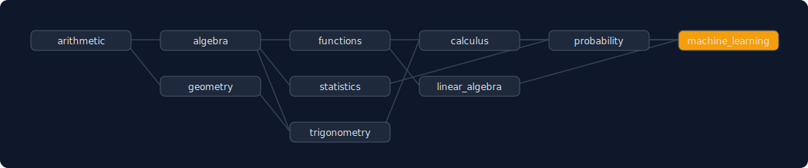

<p align="center">
  
</p>

# Trellis

**A deterministic curriculum planner. Give it skills with prerequisites and a goal — it hands back the order to learn them in.**

Trellis takes a skill dependency graph (a DAG) and a goal skill, and produces a
valid **ordered learning path**: a topological order with an alphabetical
tie-break, so the same graph always yields the same plan. It computes the minimal
set of prerequisites you actually need for a goal, measures depth (the longest
prerequisite chain), and **fails closed** on cycles or missing prerequisites —
you cannot learn a cyclic prerequisite, so Trellis reports the problem instead of
emitting a bogus plan.

## Use (sample / plan / check)

```bash
# plan the built-in sample curriculum (arithmetic -> ... -> machine_learning)
python trellis.py sample

# order the learning path to a goal (uses the sample graph, or --graph FILE)
python trellis.py plan --goal calculus
python trellis.py plan --goal machine_learning --graph examples/skills.json --svg tree.svg

# validate a skill graph (detects cycles and missing prerequisites)
python trellis.py check --graph examples/skills.json
```

The [`examples/`](examples/) files — `curriculum.svg`, `plan.txt`, `skills.json`
— were produced by Trellis from its sample graph.

## Output

```
Learning path to 'calculus' (7 steps):
   1. arithmetic
   2. algebra   (needs: arithmetic)
   3. functions   (needs: algebra)
   4. geometry   (needs: arithmetic)
   5. trigonometry   (needs: algebra, geometry)
   6. calculus   (needs: functions, trigonometry)
```

Notice: planning for `calculus` **excludes** `statistics` and `machine_learning`
— Trellis returns the *minimal* prerequisite closure, not the whole graph.

## Graph format

```json
{
  "arithmetic": [],
  "algebra": ["arithmetic"],
  "calculus": ["functions", "trigonometry"]
}
```

Each key is a skill; its value is the list of prerequisites (other skills).

## Library

```python
import trellis
trellis.validate(graph)        # -> list of problems ([] = a well-formed DAG)
trellis.plan(graph, "goal")    # -> ordered learning path (prereqs first)
trellis.topo_order(graph)      # -> full deterministic order (raises on cycle)
trellis.metrics(graph)         # -> {skills, starting_points, max_depth, valid}
```

## Guarantees

- **Deterministic** — alphabetical tie-break makes the topological order and the
  plan unique; the same graph always produces the same plan. No `random`, no clock.
- **Fail-closed** — a cycle or a missing prerequisite is reported as a problem;
  `plan` refuses to run on an invalid graph.
- **Topologically valid** — in any plan, every prerequisite comes before the
  skill that needs it.
- Standard library only. No dependencies.

## Honest note

Trellis orders the prerequisite graph you give it. It does not judge pedagogy or
invent prerequisites — the graph is the input, the ordered plan is the output. It
is the fourth distinct-character project produced by the HELIX generative loop
(verify → design → play → **learn**).

## Tests

```bash
python -m pytest tests/ -q
```

## License

MIT — see [LICENSE](LICENSE).
