<div align="center">

# AEGIS

### The firewall for AI agents.

**Every tool call. Intercepted. Classified. Blocked — before it executes.**

<br>

[](https://github.com/Justin0504/Aegis/releases/latest)
[](https://github.com/Justin0504/Aegis/releases)
[](https://github.com/Justin0504/Aegis/stargazers)
[](https://opensource.org/licenses/MIT)
[](https://pypi.org/project/agentguard-aegis/)
[](https://www.npmjs.com/package/@justinnn/agentguard)
[](https://github.com/Justin0504/Aegis/pkgs/container/aegis-gateway)
[](https://github.com/Justin0504/Aegis/actions)

[**Download** →](https://github.com/Justin0504/Aegis/releases/latest) ·
[**Roadmap** →](./ROADMAP.md) ·
[**Security** →](./SECURITY.md) ·
[**Commercial** →](./COMMERCIAL.md) ·
[**Contributing** →](./CONTRIBUTING.md)

</div>

<br>

<div align="center">

## Download AEGIS

<table>
<tr>
<td align="center" width="33%">

### 🍎 macOS

[](https://github.com/Justin0504/Aegis/releases/latest)

<sub>`AEGIS_0.1.0_aarch64.dmg` · 164 MB<br>macOS 11+ · Apple Silicon</sub>

</td>
<td align="center" width="33%">

### 🪟 Windows


<sub>`AEGIS_Setup.exe`<br>Windows 10+ · use WSL2 today</sub>

</td>
<td align="center" width="33%">

### 🐧 Linux

[](https://aegistraces.com/install)

<sub>`.deb` · `.AppImage` · `.tar.gz`<br>Ubuntu 22.04+ · Debian 12+ · RHEL 9+</sub>

</td>
</tr>
</table>

**Or one line in any terminal:**

```bash
curl -fsSL https://aegistraces.com/install | sh
```

<sub>Detects your OS + arch, downloads the verified release, drops the binary in `/usr/local/bin`, ready to run. No git clone. No Docker. No `npm install`.</sub>

</div>

---

> Your agent just called `DROP TABLE users` because the prompt said "clean up old records."
> Your agent just exfiltrated 2 GB because "the user asked for a report."
> Your agent just ran `rm -rf /` because the model hallucinated a tool name.
>
> **Not hypotheticals.** Every agent framework lets AI decide which tools to call, with what arguments, at machine speed. There is no human in the loop. There is no undo.
>
> AEGIS is the missing layer: a **pre-execution firewall** that sits between your agent and its tools, classifies every call in real time, enforces policies, blocks violations, and writes a tamper-evident audit trail — with **one line of code and zero agent changes.**

<br>

<div align="center">

<br>
<sub>The AEGIS Compliance Cockpit — real-time monitoring across all your agents.</sub>
</div>

---

## See it run

<div align="center">

**A real Claude-powered research assistant, fully integrated with AEGIS.**<br>
Watch it trace tool calls, block SQL injection, detect PII, and pause for human approval — live.


<br>

**The Compliance Cockpit: traces, policies, cost tracking, sessions, approvals.**


</div>

---

## Inside the Compliance Cockpit

Six operator views cover the end-to-end lifecycle: what agents did, who did it, what got blocked, and what your MITRE-style threat coverage looks like.

<table>
<tr>
<td width="50%">
<a href="docs/images/cockpit/overview.png"></a>
</td>
<td width="50%" valign="top">

### <sub>01</sub> Overview
Rolling 24-hour activity curve for every agent. Four load-bearing KPIs at the top: **actions**, **agents**, **blocked**, **pending review**. The lower panel streams recent agent actions and traces so ops always sees the last thing that happened without leaving the page.

</td>
</tr>

<tr>
<td width="50%">
<a href="docs/images/cockpit/activity.png"></a>
</td>
<td width="50%" valign="top">

### <sub>02</sub> Activity
Forensic audit trail of every tool call. Filterable list on the left; on the right, a per-trace explainer with **What it tried**, **Result**, **Quality** tabs. Every blocked action shows the exact policy that fired and the DSL condition that matched — no guessing which rule caught it.

</td>
</tr>

<tr>
<td width="50%">
<a href="docs/images/cockpit/agents.png"></a>
</td>
<td width="50%" valign="top">

### <sub>03</sub> Agents
The agent registry: every agent that has ever touched the gateway, with the human owner, the operational scope (**PRODUCTION** / **STAGING** / **RESTRICTED**), a hashed secret, and last-seen timestamp. Status filters for **Active / Unregistered / Suspended / Deprecated** so out-of-lifecycle agents can't slip through unnoticed.

</td>
</tr>

<tr>
<td width="50%">
<a href="docs/images/cockpit/violation.png"></a>
</td>
<td width="50%" valign="top">

### <sub>04</sub> Violations
Every block, grouped by the policy that fired: `no-privileged-file-access`, `no-arbitrary-shell-execution`, `no-destructive-sql`, `block-personal-email-in-checkout`, and any custom rule you write. Severity chips (**CRITICAL / HIGH / MEDIUM / LOW**) let a compliance lead triage by risk in one glance.

</td>
</tr>

<tr>
<td width="50%">
<a href="docs/images/cockpit/coverage.png"></a>
</td>
<td width="50%" valign="top">

### <sub>05</sub> Threat coverage
MITRE-ATLAS-style coverage: how many of the 40 agent-attack techniques you've written a detector for. Per-tactic bars for **Initial Compromise · Execution · Privilege Escalation · Credential Access · Data Exfiltration · Persistence · Discovery · Impact · Defense Evasion · Lateral Movement**. Green = fully closed, sand = open, red = uncovered — so gaps are impossible to miss.

</td>
</tr>

<tr>
<td width="50%">
<a href="docs/images/cockpit/memory.png"></a>
</td>
<td width="50%" valign="top">

### <sub>06</sub> Memory & Cross-Agent
The signals that _don't_ fit an activity row: **tainted memory recall** (agent retrieved a poisoned item from its knowledge base), **undeclared agent-to-agent data crossings**, and **pre-instruction PII** (personal data present in tool arguments before any prompt mentioned it). Each event carries a severity and a concrete fix hint (`Quarantine the memory item`, `Reset the agent's short-term memory window`, …).

</td>
</tr>
</table>

---

## Deploy in 30 seconds

<p align="center">
  <a href="https://render.com/deploy?repo=https://github.com/Justin0504/Aegis">
    </a>
  &nbsp;
  <a href="https://railway.app/new/template?template=https%3A%2F%2Fgithub.com%2FJustin0504%2FAegis">
    </a>
  &nbsp;
  <a href="https://cloud.digitalocean.com/apps/new?repo=https://github.com/Justin0504/Aegis/tree/main">
    </a>
</p>

<p align="center">
  <sub>Prefer Fly.io? <code>fly launch</code> from the repo root — <code>fly.toml</code> ships in-tree. Or use Helm: <code>helm install aegis ./charts/aegis</code>.</sub>
</p>

<sub>Each button reads the platform-specific config we ship (<code>render.yaml</code>, <code>railway.json</code>, <code>.do/app.yaml</code>) and stands up a public gateway + cockpit on the host's free tier in ~30 seconds. No CLI needed.</sub>

## Or run it locally (one command)

```bash
curl -fsSL https://raw.githubusercontent.com/Justin0504/Aegis/main/scripts/install.sh | bash
```

<sub>The installer clones the repo into <code>./aegis</code>, writes <code>.env</code>, runs <code>docker compose up -d</code>, waits for the gateway to become healthy, and prints your dashboard URL + bootstrap API key. Set <code>AEGIS_DIR</code>, <code>AEGIS_BRANCH</code>, or <code>AEGIS_NO_START=1</code> to customize.</sub>

Or do it manually:

```bash
git clone https://github.com/Justin0504/Aegis
cd Aegis
docker compose up -d
```

| Service | URL | What it does |
|---------|-----|--------------|
| **Compliance Cockpit** | [localhost:3000](http://localhost:3000) (Docker) · [localhost:13003](http://localhost:13003) (dev) | Dashboard — traces, policies, approvals, costs |
| **Gateway API** | [localhost:8080](http://localhost:8080) | Policy engine — classifies, checks, blocks |

Then add **one line** to your agent:

```python
import agentguard
agentguard.auto("http://localhost:8080", agent_id="my-agent")

# Your existing code — completely unchanged
import anthropic
client = anthropic.Anthropic()
response = client.messages.create(model="claude-sonnet-4-20250514", tools=[...], messages=[...])
```

For supported Python integrations, importing `agentguard` once is enough to enable auto-instrumentation:

```bash
python -c "import agentguard; agentguard.auto('http://localhost:8080', agent_id='my-agent')"
```

That's it. Every tool call is now classified, policy-checked, and recorded in a tamper-evident audit trail **before** execution.

---

## Recently shipped (last batch)

| Capability | Endpoint / file | What it solves |
|---|---|---|
| **Agent registry + identity** | `POST /api/v1/agents` · [agent-registry.ts](packages/gateway-mcp/src/services/agent-registry.ts) | `agent_id` was a free-form string anyone could pass. Now it's first-class identity with status (active/suspended/deprecated/unregistered), declared tool scope, per-agent budget, optional Ed25519 / shared-secret authentication. |
| **AEGIS Agent Threat Ontology v1** | `GET /api/v1/ontology` · [agent-threats.ts](packages/core-schema/src/ontology/agent-threats.ts) | 10 tactics × 40 techniques (AAT-T*) — a published, versioned taxonomy of agent-specific threats. Coverage at `GET /coverage` shows which nodes this deployment defends against; tenant detectors automatically extend it. |
| **Detector plugin contract** | [`Detector` interface](packages/core-schema/src/detector.ts) | Customer security teams or 3rd parties register a `Detector` against the live registry — same signal type, same decision merger, same audit / sink / transparency-log fan-out as built-ins. |
| **LLM egress proxy** | `/api/v1/llm-proxy/{openai,anthropic}/*` · [proxy/](packages/gateway-mcp/src/proxy/) | Customer changes one env var (`OPENAI_BASE_URL=…aegis…/openai/v1`) — every LLM call now flows through the detector chain, audit, transparency log, and sinks. Works for any language / any closed-source agent platform. |
| **Universal SIEM sinks** | `tenant_config.sinks[]` · [sinks/](packages/gateway-mcp/src/sinks/) | Declarative `http` / `syslog` / `stdout` sinks for Splunk HEC, Datadog Logs, Sumo, QRadar, Graylog — customer integrates by config write, not code release. Bounded DLQ + retry + field-mapping templates. |
| **RFC 6962 transparency log** | `GET /api/v1/transparency-log/proof/:idx` · [transparency-log.ts](packages/gateway-mcp/src/services/transparency-log.ts) | Append-only Merkle tree over audit + evidence-pack events. Signed roots + inclusion proofs let customers verify "this audit row existed at this date" offline — defeats the "you control the key" objection. |
| **Per-framework compliance bundles** | `POST /api/v1/compliance/bundle/:fw` · [compliance-bundle.ts](packages/gateway-mcp/src/services/compliance-bundle.ts) | One POST → signed JSON bundle mapping SOC 2, ISO 27001, NIST AI RMF, EU AI Act controls to live AEGIS evidence. Hands the auditor a verifiable artifact, not screenshots. |
| **Budget guard** | `tenant_config.budget` · [budget-guard.ts](packages/gateway-mcp/src/services/budget-guard.ts) | Daily / monthly / per-agent / per-session USD limits with warn / block actions. Coverage of AAT-T8002. |
| **OTLP trace export** | `tenant_config.observability.otlp` · [otlp-exporter.ts](packages/gateway-mcp/src/services/otlp-exporter.ts) | Per-tenant push to any OTLP/HTTP backend (Datadog, Honeycomb, Grafana Tempo, New Relic). Customers see AEGIS spans alongside their non-LLM infra traces. |
| **Cross-agent + IPI + memory-poison + sensitive-exfil detectors** | [detectors/built-in/](packages/gateway-mcp/src/detectors/built-in/) | Coverage of AAT-T10001 (trust abuse), T1001 (indirect prompt injection), T6001 (memory poisoning), T5001 (sensitive-context exfiltration). |
| **Ed25519-signed release artifacts** | [tools/release-sign/](tools/release-sign/) + [.well-known/aegis-release-pubkey.pem](.well-known/aegis-release-pubkey.pem) | Every npm tarball + PyPI wheel ships with a signature manifest verifiable offline against the AEGIS-pinned public key. Defeats mirror tampering / in-transit forgery. |

Ontology coverage at the time of this batch: **28/40 (70%)** across the 10 tactics. See live status at `GET /api/v1/ontology/coverage` or in the Cockpit's `/coverage` page.

---

## Why AEGIS?

The agent-guardrail category is consolidating around two camps: closed
enterprise platforms (Cisco AI Defense, Palo Alto Prisma AIRS), and
narrow open-source libraries (LlamaFirewall, NeMo, Guardrails AI).
AEGIS is the open-source platform that ships the full vertical —
gateway, cascade, DSL, dashboard, audit trail, approvals — in one repo.

The rows below are AEGIS's load-bearing differentiators — capabilities
that don't ship in the incumbent guardrail libraries. Full 22-row
matrix at [aegistraces.com/compare](https://aegistraces.com/compare).

|  | Lakera | NeMo | Cisco AI Defense | Guardrails AI | **AEGIS** |
|--|:--:|:--:|:--:|:--:|:--:|
| Open source / self-hostable | paid tier | ✅ | ❌ | ✅ | ✅ |
| Pre-execution blocking | ✅ | ✅ | ✅ | ✅ | ✅ |
| Agent identity + secret rotation | ❌ | ❌ | ❌ | ❌ | **✅** |
| Per-agent declared tool scope | ❌ | ❌ | ❌ | ❌ | **✅** |
| Per-agent / per-tenant budget guard | ❌ | ❌ | ❌ | ❌ | **✅** |
| Agent Threat Ontology + coverage map | ❌ | ❌ | ❌ | ❌ | **✅** |
| Per-tenant Policy DSL (fail-safe) | ❌ | Colang | ❌ | ❌ | **✅** |
| RFC 6962 transparency log (offline-verifiable) | ❌ | ❌ | ❌ | ❌ | **✅** |
| Cross-agent compromise correlator | ❌ | ❌ | ❌ | ❌ | **✅** |
| Human-in-the-loop approval flow | ❌ | ❌ | ❌ | ❌ | **✅** |
| Reversible actions (compensator + saga) | ❌ | ❌ | ❌ | ❌ | **✅** |

> If your point of comparison is *observability* (LangFuse, Helicone,
> Arize) — those tell you **what happened**. AEGIS **prevents it from
> happening** by sitting on the execution path itself.

---

## How it works

```mermaid
%%{ init: {
  "theme": "base",
  "themeVariables": {
    "primaryColor":        "#f2edd8",
    "primaryTextColor":    "#0a0a0a",
    "primaryBorderColor":  "#0a0a0a",
    "lineColor":           "#5c5a50",
    "secondaryColor":      "#ece6cf",
    "tertiaryColor":       "#eae3d2",
    "fontFamily":          "ui-sans-serif, -apple-system, Inter, sans-serif"
  }
}}%%
flowchart LR
    A(["Agent calls a tool"]) --> B["SDK · HTTP proxy · MCP proxy<br/><sub>zero-config interception</sub>"]

    subgraph GW["<b>AEGIS Gateway</b>&nbsp;·&nbsp;5-stage pipeline"]
        direction TB
        P1["<b>1. Classify</b><br/><sub>SQL · file · network · shell</sub>"]
        P2["<b>2. Anomaly</b><br/><sub>baseline deviation · spike</sub>"]
        P3["<b>3. Evaluate</b><br/><sub>AJV policies · injection · exfil</sub>"]
        P4["<b>4. Match DSL</b><br/><sub>per-tenant rules · fail-safe</sub>"]
        P5["<b>5. Decide</b><br/><sub>strictest wins</sub>"]
        P1 --> P2 --> P3 --> P4 --> P5
    end

    B --> GW
    P5 --> D{"decision"}

    D -->|allow| EXE["Tool executes"]
    D -->|pending| REVIEW["Human review<br/>in Cockpit"]
    D -->|block| ERR["AgentGuardBlockedError<br/><sub>agent gets the reason</sub>"]

    REVIEW -->|approve| EXE
    REVIEW -->|reject| ERR

    EXE --> RECEIPT["Signed &amp; hash-chained trace<br/><sub>Ed25519 · SHA-256 · RFC 6962 Merkle log</sub>"]

    classDef stage    fill:#f2edd8,stroke:#0a0a0a,stroke-width:1px,color:#0a0a0a;
    classDef gate     fill:#ece6cf,stroke:#0a0a0a,stroke-width:1.5px,color:#0a0a0a;
    classDef success  fill:#d6e2d2,stroke:#4a6b4f,stroke-width:1px,color:#0a0a0a;
    classDef warn     fill:#f5e1c8,stroke:#a06e2a,stroke-width:1px,color:#0a0a0a;
    classDef block    fill:#e7c8c4,stroke:#8b3a2f,stroke-width:1px,color:#0a0a0a;
    classDef receipt  fill:#dfe4e6,stroke:#4b6a72,stroke-width:1px,color:#0a0a0a;

    class P1,P2,P3,P4,P5 stage;
    class D gate;
    class EXE,RECEIPT success;
    class REVIEW warn;
    class ERR block;
```



**Zero-config classification** — works on any tool name, any argument shape:

| Your tool call | AEGIS detects | How |
|----------------|---------------|-----|
| `run_query(sql="SELECT...")` | `database` | SQL keyword in args |
| `my_tool(path="/etc/passwd")` | `file` | Sensitive path pattern |
| `do_thing(url="http://...")` | `network` | URL in args |
| `helper(cmd="rm -rf /")` | `shell` | Command injection signal |
| `custom_fn(prompt="ignore previous...")` | `prompt-injection` | Known attack pattern |
| `exec(cmd="npm publish")` | `supply-chain` | Publish/deploy command |

---

## Key Features

### Pre-Execution Blocking

AEGIS doesn't just log — it **stops dangerous tool calls before they execute**.

```python
agentguard.auto(
    "http://localhost:8080",
    blocking_mode=True,             # pause HIGH/CRITICAL calls for human review
    human_approval_timeout_s=300,   # auto-block after 5 min with no decision
)
```

<table>
<tr>
<td width="50%">

**SQL injection — blocked instantly**


</td>
<td width="50%">

**High-risk action — awaiting human approval**


</td>
</tr>
</table>

The agent pauses. You open the Cockpit, inspect the exact arguments, and click **Allow** or **Block**. The agent resumes in under a second.

```python
from agentguard import AgentGuardBlockedError

try:
    response = client.messages.create(...)
except AgentGuardBlockedError as e:
    print(f"Blocked: {e.tool_name} — {e.reason} ({e.risk_level})")
```

### Policy Engine

Seven AJV policies ship by default. Create more in plain English — the AI
assistant generates the JSON schema for you.

| Policy | Risk | What it catches |
|--------|------|-----------------|
| SQL Injection Prevention | HIGH | `DROP`, `DELETE`, `TRUNCATE` in database tools |
| File Access Control | MEDIUM | Path traversal (`../`), `/etc/`, `/root/` |
| Network Access Control | MEDIUM | HTTP (non-HTTPS) requests |
| Prompt Injection Detection | CRITICAL | "ignore previous instructions" patterns |
| Data Exfiltration Prevention | HIGH | Large payloads to external endpoints |
| Source Map Leak Prevention | HIGH | `npm publish` when `.map` files present |
| Supply Chain Security | HIGH | Package publish, container push, deployment ops |

> *"Block all file deletions outside the /tmp directory"* → Describe button → policy created instantly.

### Per-Tenant Policy DSL

Each tenant gets a YAML/JSON Policy DSL that runs **on top of** the
defaults. The DSL can:

- Route specific tool categories to human review
- Escalate decisions on anomaly score, agent identity, or deployment mode
- Add new block rules for tenant-specific patterns
- Flip ambiguous calls from *allow* → *pending*

**Fail-safe semantics.** A DSL rule can only *tighten* a decision —
`allow` from the DSL can never override an AJV or anomaly `block`. This
is enforced structurally: the final decision is always
`strictest(AJV, anomaly, DSL)`.

```yaml
version: 1
rules:
  - name: escalate-high-anomaly
    when: { anomaly.score: { ">": 0.7 } }
    then: { decision: pending, reason: "anomaly score above 0.7" }

  - name: block-shell-in-financial
    when:
      all:
        - classifier.category: shell
        - tenant.deploymentMode: financial
    then: { decision: block }
```

Edit in the Cockpit Monaco editor (`/dsl`), test with the **Dry Run**
panel, save → live for new tool calls (hot-reload, no restart).

### Deployment Mode

Five ready-made templates — one click to apply on the Settings page or
via `POST /api/v1/config/apply-template`:

| Template | L1 | L2 | L3 | Retention | Best for |
|----------|----|----|----|-----------|----------|
| `dev` | ✅ | ❌ | ❌ | 7 d | Local development, minimal cost |
| `standard` | ✅ | ✅ | escalate | 90 d | Default |
| `strict` | ✅ | ✅ | all | 180 d | High-sensitivity workloads |
| `financial` | ✅ | ✅ | all | 7 yr (SOX) | Banking / fintech |
| `healthcare` | ✅ | ✅ | all | 6 yr (HIPAA) | PHI handling |

Per-tenant config is stored in `organizations.settings`, hot-reloads via
an in-process ConfigBus, and every change is recorded in the admin audit
log.

### Agent Alignment Auditor

For agents whose chain-of-thought you can see (LangChain / ReAct, CrewAI),
AEGIS audits each proposed action against the **declared goal** of the
current run. If the agent silently grew a hidden sub-task (`scope-expansion`)
or its reasoning no longer matches the user's request (`drift`), the verdict
shows up in the Cockpit's Alignment tab *and* feeds straight into the
Policy DSL:

```yaml
rules:
  - name: pause-on-drift
    when:
      any:
        - alignment.score: { "<": 0.5 }
        - alignment.drifted: true
    then: { decision: pending, reason: "agent drifted from declared goal" }
```

**Closed loop on LangChain** — the `AlignmentCallback` records each verdict
into a small in-process buffer; the SDK's auto-instrumentation reads it on
the next `/check` so DSL rules fire on the *same* hop without any extra
wiring in user code.

**Not on LangChain or CrewAI?** Reach for the framework-agnostic helper:

```python
from agentguard.integrations.alignment import check

check(
    agent_id="my-agent",
    declared_goal="Summarise this week's customer-feedback survey.",
    thought_chain=["Thought: I should fetch the survey first."],
    proposed_action={
        "tool_name": "execute_sql",
        "arguments": {"sql": "DELETE FROM audit_logs WHERE 1=1"},
    },
    gateway_url="http://localhost:8080",
)
# → {"score": 0.18, "drifted": true, "signals": ["scope-expansion"], ...}
```

Same shape exists in `@justinnn/agentguard` as `alignmentCheck({...})`.
Verdicts auto-flow into the next `/check`. To audit a snippet interactively
without writing code, the Cockpit's **Alignment** page in the sidebar is a
live playground for the same endpoint.

### Code Shield

Agents that write code now get a fast pre-execution scan. AEGIS runs 19
curated regex rules across Python, JavaScript, shell, SQL, and cross-
language secret formats — `exec` / `eval`, `subprocess(shell=True)`,
`rm -rf /`, `DROP TABLE` without a `WHERE`, leaked AWS / OpenAI /
GitHub keys, PEM private blocks, and friends. Sub-millisecond per scan,
no LLM round-trip.

```bash
curl -X POST $GATEWAY/api/v1/code-shield/scan \
  -H "X-API-Key: $KEY" \
  -d '{"language": "python", "code": "exec(input())"}'
# → { "worst": "CRITICAL", "findings": [...], "rules": ["py.exec"] }
```

The worst severity flows into the DSL too:

```yaml
- name: block-critical-codegen
  when: { code_shield.worst: CRITICAL }
  then: { decision: block, reason: "unsafe code generation" }
```

### Behavioral Anomaly Detection

AEGIS builds a behavioral profile for each agent and flags deviations in real time — no manual rules required.

**Nine-dimensional analysis:**

| Dimension | What it catches |
|-----------|-----------------|
| Tool novelty | Agent uses a tool it has never called before |
| Frequency spike | Sudden burst of calls (3x above normal rate) |
| Argument shape drift | Parameters don't match historical patterns |
| Argument length outlier | Unusually large payloads (data exfiltration signal) |
| Temporal anomaly | Calls at unusual hours |
| Sequence anomaly | Unexpected tool ordering (e.g. `delete` without prior `read`) |
| Cost spike | Single call costs 5x the agent's average |
| Risk escalation | Jump from LOW-risk to HIGH-risk tools |
| Session burst | Too many calls in one session |

**Cold-start safe** — AEGIS learns for the first 200 traces before blocking, so new agents are never false-positived.

### Proxy Interception (for closed-source agents)

For agents you can't modify (compiled binaries, third-party tools), AEGIS provides two proxy modes:

**HTTP Forward Proxy** — intercepts LLM API calls (Anthropic / OpenAI):

```bash
# Start the proxy
agentguard http-proxy --port 8081 --agent-id my-agent

# Point any agent at it — zero code changes
export ANTHROPIC_BASE_URL=http://localhost:8081
export OPENAI_BASE_URL=http://localhost:8081/v1
```

Captures: full prompt/response, tool_use calls, token usage, cost. Supports SSE streaming.

**MCP Stdio Proxy** — wraps any MCP server with policy enforcement:

```bash
agentguard mcp-proxy \
  --server npx -y @modelcontextprotocol/server-filesystem / \
  --agent-id my-agent --blocking
```

Every MCP `tools/call` is policy-checked and anomaly-scored before reaching the upstream server.

| Proxy | Intercepts | Use case |
|-------|-----------|----------|
| HTTP Proxy | LLM API calls (Anthropic/OpenAI) | Closed-source agents, binary tools |
| MCP Proxy | MCP tool calls (stdio JSON-RPC) | Claude Desktop, any MCP client |
| SDK | LLM SDK calls (monkey-patch) | Your own Python/JS/Go code |

### Compliance Cockpit

<table>
<tr>
<td width="50%">

**Forensic trace detail**


</td>
<td width="50%">

**Policy management**


</td>
</tr>
<tr>
<td width="50%">

**Token cost tracking**


</td>
<td width="50%">

**Session grouping**


</td>
</tr>
</table>

**Everything you need in one dashboard:**
- **Live Feed** — every tool call as it happens, with risk badges
- **Approvals** — one-click allow/block for pending checks
- **Agent Baseline** — 7-day behavioral profile per agent
- **Anomaly Detection** — automatic flagging of spikes, error bursts, unusual patterns
- **PII Detection** — auto-redacts SSN, email, phone, credit card, API keys
- **Cost Tracking** — token usage and USD cost across 40+ models
- **Alert Rules** — Slack, PagerDuty, or webhook on violations/cost spikes
- **Supply Chain Security** — pre-publish scanning for source maps, secrets, and dangerous files
- **LLM-as-a-Judge** — automated trace evaluation (safety, helpfulness, correctness, compliance) via OpenAI/Anthropic/Gemini
- **Forensic Export** — PDF compliance reports and CSV audit bundles
- **Kill Switch** — auto-revoke agents after N violations
- **Enterprise Admin** — multi-tenancy, RBAC, usage quotas, SLA metrics, data retention

### Enterprise (B2B)

AEGIS is built for enterprise deployment from day one.

**Multi-Tenancy & RBAC** — isolate data per organization, assign roles (owner / admin / auditor / viewer), issue scoped API keys with rate limits and expiry:

```bash
agentguard admin create-org --name "Acme Corp" --slug acme --plan enterprise
agentguard admin create-user <org-id> -e admin@acme.com -r admin
agentguard admin create-key <org-id> --name "Production" --rate-limit 5000
```

**Admin Audit Log** — every policy change, approval decision, key rotation, and kill-switch action is recorded in an immutable audit trail. Required for SOC 2, ISO 27001, HIPAA, and FedRAMP:

```bash
agentguard admin audit-log --action policy.create --limit 50
```

**Usage Metering & Quotas** — track API calls, traces, judge evaluations per org. Plan-based limits (free / pro / enterprise) with automatic enforcement:

```bash
agentguard admin usage <org-id>
```

**SLA Metrics** — real-time P50/P95/P99 latency tracking, uptime percentage, error rates:

```bash
agentguard admin sla --hours 24
```

**Data Retention** — configurable auto-purge per resource type (traces, violations, audit log). GDPR / CCPA compliant:

```bash
agentguard admin retention
```

### Supply Chain Security

AI agents can `npm publish`, `docker push`, or `kubectl apply` — publishing source maps, secrets, and internal code without human review. AEGIS intercepts these operations before they execute.

**What AEGIS catches:**

| Threat | Detection | Action |
|--------|-----------|--------|
| Source map leak (`.map` files with full source) | Pre-publish scan, classifier pattern | Block + require approval |
| Secrets in build artifacts (AWS keys, API tokens) | 11 regex patterns across build output | Block immediately |
| Dangerous files (`.env`, `.npmrc`, private keys) | File name + content scanning | Block immediately |
| Unsafe publish commands (`npm publish`, `docker push`) | Tool classifier + policy engine | Require human approval |
| `sourceMappingURL` references in production JS | Content scan | Flag as MEDIUM risk |

**CLI pre-publish scanner:**

```bash
agentguard scan ./my-package              # scan before publish
agentguard scan ./my-package --fix        # auto-add *.map to .npmignore
```

Scans for `.map` files, embedded `sourcesContent`, secrets (AWS/GitHub/npm/OpenAI/Anthropic keys, JWTs, database URLs), dangerous config files, and validates `.npmignore` / `package.json` files field.

**Verify the AEGIS release you just downloaded:**

Every npm tarball and PyPI wheel published from this repository ships
with an Ed25519 signature manifest. Pin trust on the AEGIS-published
public key once and verify every future release:

```bash
# Public key — commit to your install machine once.
curl -sLo aegis-release-pubkey.pem \
  https://raw.githubusercontent.com/Justin0504/Aegis/main/.well-known/aegis-release-pubkey.pem

# Verify any release (npm tarball, PyPI wheel, Docker manifest).
node tools/release-sign/verify.mjs \
  --in     ./agentguard-1.2.0.tgz \
  --sig    ./agentguard-1.2.0.tgz.sig.json \
  --pubkey ./aegis-release-pubkey.pem
# OK
#   sha256:          df54442…
#   pubkey matches:  yes
```

Threat model, key bootstrap, and CI integration: [tools/release-sign/README.md](tools/release-sign/README.md).

### Cryptographic Audit Trail

Every trace is:
- **Optional Ed25519 signing** — available in the Python SDK for cryptographically verifiable traces
- **SHA-256 hash-chained** — each trace commits to the previous, tamper-evident
- **Immutable** — any modification breaks the chain, detectable by any third party

**Verify it yourself** — the chain is reachable from three surfaces so
nobody has to take our word for it:

```bash
# 1. From the CLI — fits a cron job or CI gate.
agentguard integrity verify <agent-id>
# → ✓ agent <id>  (142 traces, 3ms) · latest abc12345…

# 2. From the REST API — for your own audit pipelines.
curl -H "X-API-Key: $KEY" \
  "$GATEWAY/api/v1/integrity/verify?agent_id=<agent-id>"
# → { "ok": true, "total": 142, "latest_trace_id": "...", ... }

# 3. From the Cockpit — Audit Log page has an inline "Verify chain"
#    widget. Click any agent_id in the table to verify on the spot.
```

Linkage verification catches insertions, deletions, and reorders in
the trace chain. Single-row content tamper detection (a separate
pre-redaction canonical hash field) is on the roadmap for v0.4 —
today, that threat model is covered by the optional Ed25519
signature path. The two are complementary: hash chain detects
in-place edits that nobody bothers to re-sign; signatures detect
edits that don't have your private key.

This isn't just logging. It is a **tamper-evident audit record** for reviewing how your AI agents operated within policy.

---

## SDK Support

**9 Python frameworks. JavaScript/TypeScript. Go. All auto-patched, zero code changes.**

<table>
<tr>
<td>

**Python** — `pip install agentguard-aegis`

| Framework | Status |
|-----------|--------|
| Anthropic | ✅ auto-patched |
| OpenAI | ✅ auto-patched |
| LangChain / LangGraph | ✅ auto-patched |
| CrewAI | ✅ auto-patched |
| Google Gemini | ✅ auto-patched |
| AWS Bedrock | ✅ auto-patched |
| Mistral | ✅ auto-patched |
| LlamaIndex | ✅ auto-patched |
| smolagents | ✅ auto-patched |

</td>
<td>

**JavaScript / TypeScript** — `npm install @justinnn/agentguard`

```typescript
import agentguard from '@justinnn/agentguard'
agentguard.auto('http://localhost:8080', {
  agentId: 'my-agent',
  blockingMode: true,
})
// Existing code unchanged
```

**Go** — `go get github.com/Justin0504/Aegis/packages/sdk-go`

```go
guard := agentguard.Auto()
defer guard.Close()

result, err := guard.Wrap("query_db", args,
  func() (any, error) {
    return db.Query("SELECT ...")
  },
)
```

Zero external dependencies. Standard library only.

</td>
</tr>
</table>

---

## Integrations

### Claude Desktop (MCP)

Ask Claude about your agents directly:

```json
{
  "mcpServers": {
    "aegis": { "url": "ws://localhost:8080/mcp-audit" }
  }
}
```

> *"What did agent X do in the last hour?"* → Claude queries AEGIS and tells you.

Available tools: `query_traces`, `list_violations`, `get_agent_stats`, `list_policies`

### Claude Code

One command to audit every tool call in Claude Code:

```bash
agentguard claude-code setup --blocking
# Restart Claude Code — done.
```

Every `Read`, `Write`, `Bash`, `Edit` call is now policy-checked and traced. HIGH/CRITICAL calls require human approval in the Cockpit.

### CLI

```bash
agentguard configure --url <url> --bootstrap   # fetch API key, persist locally
agentguard status                    # gateway health
agentguard doctor                    # 5-step health probe (gateway, auth, policies, code-shield, alignment)
agentguard traces list --agent X     # query traces
agentguard costs                     # token/cost summary
agentguard anomalies list            # behavioral anomaly events
agentguard http-proxy                # start HTTP forward proxy
agentguard mcp-proxy --server ...    # start MCP stdio proxy
agentguard judge batch               # auto-evaluate unscored traces via LLM
agentguard judge stats               # judge score statistics & trends
agentguard scan [dir] [--fix]        # pre-publish supply chain scan
agentguard code-shield scan FILE...  # static checks on agent-generated code (pre-commit / CI)
agentguard code-shield rules         # list the 19 built-in CodeShield rules
agentguard kill-switch revoke <id>   # emergency agent shutdown
agentguard admin orgs                # list organizations (multi-tenant)
agentguard admin create-org          # create a new tenant organization
agentguard admin users <org>         # list users and roles
agentguard admin audit-log           # view admin audit trail (SOC 2)
agentguard admin usage <org>         # usage metering & quota dashboard
agentguard admin sla                 # SLA metrics (P50/P95/P99 latency)
agentguard admin retention           # data retention policies (GDPR)
```

### OpenTelemetry

Forward every trace to Datadog, Grafana, Jaeger, or any OTLP-compatible collector:

```bash
OTEL_ENABLED=true OTEL_EXPORTER_OTLP_ENDPOINT=http://localhost:4318 node dist/server.js
```

Each span carries: `aegis.agent_id`, `aegis.risk_level`, `aegis.blocked`, `aegis.cost_usd`, `aegis.pii_detected`

### Alerting

Threshold-based alerts delivered to **Slack**, **PagerDuty**, or custom **webhooks** when violations, cost spikes, or anomalies are detected.

---

## Fine-Tuning

Not everything needs to be blocked. Precision controls for production:

```python
agentguard.auto(
    "http://localhost:8080",
    block_threshold="HIGH",          # only block HIGH and CRITICAL (default)
    allow_tools=["read_file"],       # whitelist specific tools
    allow_categories=["network"],    # whitelist entire categories
    audit_only=True,                 # log everything, block nothing
    tool_categories={                # override auto-classification
        "my_query_runner": "database",
        "send_email": "communication",
    },
)
```

---

## Architecture

```
packages/
  gateway-mcp/          Express + SQLite gateway (policy engine, anomaly detector, classifier, PII, cost, OTEL)
  sdk-python/           Python SDK — 9 frameworks auto-patched
  sdk-js/               TypeScript SDK — Anthropic, OpenAI, LangChain, Vercel AI
  sdk-go/               Go SDK — zero dependencies, stdlib only
  core-schema/          Shared Zod schemas (trace format, risk levels, approval status)
  cli/                  CLI tool + HTTP/MCP proxies for closed-source agent interception

apps/
  compliance-cockpit/   Next.js dashboard (10 tabs, live feed, approvals, admin panel, forensic export)

demo/
  live-agent/           Real Claude-powered demo agent with chat UI (FastAPI)
  showcase_agent.py     Multi-step feature demonstration script
```

**Tech Stack**: Node.js 20, Express, SQLite, Next.js 14, React 18, TailwindCSS, Python 3.10+, Go 1.21+

> **Deeper reads** (role-based):
> - [`docs/ARCHITECTURE.md`](./docs/ARCHITECTURE.md) — component map, data flow, reversibility model, prior art
> - [`docs/OPERATIONS.md`](./docs/OPERATIONS.md) — health, Prometheus + Grafana, rollback runbook, replay
> - [`docs/TESTING.md`](./docs/TESTING.md) — 4 CI harnesses (unit + e2e + isolation + SDK chaos)
> - [`tools/grafana/`](./tools/grafana/README.md) — importable dashboards
> - [`GETTING_STARTED.md`](./GETTING_STARTED.md) · [`PERFORMANCE.md`](./PERFORMANCE.md) · [`CONTRIBUTING.md`](./CONTRIBUTING.md)

---

## Deployment

### Docker Compose (recommended)

```bash
docker compose up -d                              # production
docker compose -f docker-compose.dev.yml up       # development (hot-reload)
```

### Manual

```bash
# Gateway
cd packages/gateway-mcp && npm install && npm run build && node dist/server.js

# Cockpit
cd apps/compliance-cockpit && npm install && npm run build && npm start

# Agent
pip install agentguard-aegis
```

### Cloud

Pre-configured for **Render** (`render.yaml`), **Railway** (`railway.json`), and **Kubernetes** (`kubernetes/`).

### Environment Variables

| Variable | Default | Description |
|----------|---------|-------------|
| `GATEWAY_PORT` | `8080` | Gateway listen port |
| `DB_PATH` | `./agentguard.db` | SQLite database path |
| `OTEL_ENABLED` | `false` | Enable OpenTelemetry export |
| `NEXT_PUBLIC_GATEWAY_URL` | `http://localhost:8080` | Cockpit → Gateway URL |

---

## Try the Demo Agent

A real Claude-powered research assistant with its own chat UI, fully integrated with AEGIS:

```bash
# Prerequisites: gateway on :8080, cockpit on :3000
cd demo/live-agent
pip install -r requirements.txt
export ANTHROPIC_API_KEY=sk-ant-...
python app.py
```

Open [localhost:8501](http://localhost:8501) and follow the guided prompts:

1. **Search for AI trends** → traces appear in Live Feed, cost tracked
2. **Read Q1 revenue data** → file access tracing, session grouping
3. **Query top customers** → safe SQL execution (ALLOW)
4. **SQL injection attempt** → blocked instantly (BLOCK)
5. **Analyze text with SSN** → PII auto-detected and flagged
6. **Send a report** → blocking mode, requires human approval in Cockpit

---

## Paper

If you use AEGIS in your research, please cite our paper:

> **AEGIS: No Tool Call Left Unchecked -- A Pre-Execution Firewall and Audit Layer for AI Agents**
> Aojie Yuan, Zhiyuan Su, Yue Zhao
> *arXiv:2603.12621*, 2026
> [[PDF]](https://arxiv.org/abs/2603.12621)

```bibtex
@article{yuan2026aegis,
  title={AEGIS: No Tool Call Left Unchecked -- A Pre-Execution Firewall and Audit Layer for AI Agents},
  author={Yuan, Aojie and Su, Zhiyuan and Zhao, Yue},
  journal={arXiv preprint arXiv:2603.12621},
  year={2026}
}
```

---

## Contributing

Issues and PRs welcome. Development setup:

```bash
git clone https://github.com/Justin0504/Aegis && cd Aegis
docker compose -f docker-compose.dev.yml up    # hot-reload enabled
```

---

<div align="center">

**MIT Licensed** · Self-hostable · Infrastructure-first · Designed to keep sensitive agent workflows under your control

Built by [Justin](https://github.com/Justin0504)

</div>
